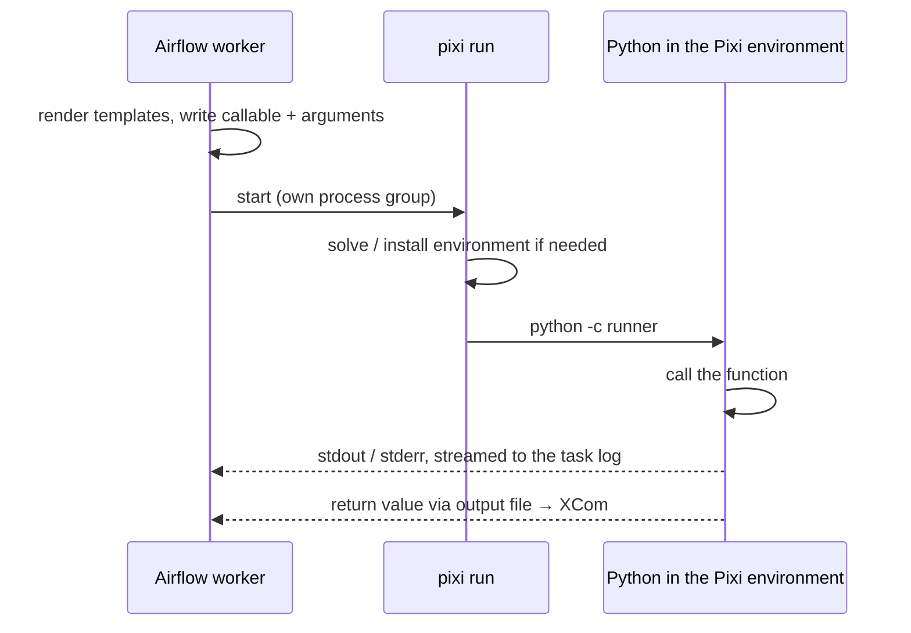

# Pixi Operator

Use the [`PixiOperator`][airflow.providers.pixi.operators.pixi.PixiOperator] to run a Python
callable inside a [Pixi](https://pixi.sh) environment. The environment can come from an existing
Pixi project, from a manifest file, or from a manifest you write inline in the DAG.

!!! tip
    For TaskFlow, use the [`@task.pixi`](../decorators/pixi.md) decorator. It accepts the same
    arguments. To build your own operators or decorators on top of it, see
    [Building on the Pixi Operator](../extending.md).

## Using the operator

The callable is either a function or a `"module.path:callable_name"` string:

- A **function** is shipped as source, as `@task.virtualenv` does, so it can be defined in the DAG
  file. It must be self-contained: imports go inside it, and it cannot use variables from enclosing
  functions (pass them as arguments instead). Lambdas are not supported.
- A **string** is imported inside the environment, for code that lives in the project or is
  installed there. The manifest's directory is the working directory, so modules next to it are
  importable.

Either may be a coroutine function (`async def`): the environment awaits it with `asyncio.run` and
takes the result. The return value becomes the task's XCom.

```python title="tests/system/pixi/example_pixi.py"
--8<-- "tests/system/pixi/example_pixi.py:pixi_operator"
```

## Choosing the environment

Specify the manifest in exactly one way. The operator raises `ValueError` when the DAG is parsed
otherwise.

=== "Project directory"

    `pixi_project_path` is a directory with a `pixi.toml` or `pyproject.toml`. With
    `lock_mode="locked"` or `"frozen"`, the environment is installed from the project's `pixi.lock`,
    which makes this the most reproducible option; see [The lock file](#the-lock-file).

    ```python
    PixiOperator(
        task_id="train",
        pixi_project_path="/path/to/pixi/project",
        lock_mode="locked",
        python_callable="mymodule:train",
        op_kwargs={"epochs": 3},
        environment="cuda",
    )
    ```

=== "Manifest file"

    `pixi_toml_path` points at a `pixi.toml` or `pyproject.toml`, and pixi uses exactly that file.

    ```python
    PixiOperator(
        task_id="evaluate",
        pixi_toml_path="/repo/pixi.toml",
        lock_mode="locked",
        environment="test",
        python_callable="mymodule:evaluate",
    )
    ```

=== "Inline manifest"

    `dependencies` (conda) and/or `pypi_dependencies` describe the environment directly in the DAG.

    ```python
    PixiOperator(
        task_id="report",
        dependencies={"python": ">=3.10", "numpy": "*"},
        pypi_dependencies={"pandas": ">=2.0"},
        channels=["conda-forge"],
        env_cache_path="/var/cache/pixi-airflow",
        python_callable="mymodule:report",
    )
    ```

Both paths are templated, so they can come from params or Variables, for example
`pixi_project_path="{{ params.project }}"`.

### Relative paths

A relative `pixi_project_path`, `pixi_toml_path` or `env_cache_path` is relative to the directory of
the DAG file, not to the worker's working directory. A project kept next to the DAG in the DAG
bundle can be referenced like this:

```text
dags/
├── training.py
└── training-env/
    ├── pixi.toml
    └── pixi.lock
```

```python
PixiOperator(
    task_id="train",
    pixi_project_path="training-env",
    lock_mode="frozen",
    python_callable="train:main",
)
```

The path is resolved when the task runs, after templates are rendered, so it points at the DAG file's
location on that worker. A task without a DAG resolves it against the working directory. Absolute
paths are used as they are. This applies to the operators that run pixi on the worker: this one,
the [Bash operator](bash.md) and the [sensor](../sensors/pixi.md). For the
[Kubernetes pod operator](kubernetes.md), paths are paths in the pod.

### The lock file

`pixi run` keeps `pixi.lock` up to date with the manifest: if the manifest changed since the lock file
was written, or there is no lock file, plain `pixi run` solves the environment again and writes a new
`pixi.lock` before running. A run can then get different package versions than the ones you tested,
and it needs write access to the project directory.

`lock_mode` changes that, for `pixi_project_path` and `pixi_toml_path`:

| `lock_mode` | Flag | Behaviour |
|---|---|---|
| `None` (default) | | Solves again and updates `pixi.lock` when it is out of date. |
| `"locked"` | `--locked` | Installs from `pixi.lock`; fails if it is out of date with the manifest. |
| `"frozen"` | `--frozen` | Installs from `pixi.lock` as it is, without checking it against the manifest. |

Use `"locked"` to run exactly what the lock file pins, and to fail when someone changed the manifest
without locking again. Use `"frozen"` to run what the lock file pins even if the manifest no longer
matches it. Neither rewrites `pixi.lock`. Pixi still installs the environment into the project's
`.pixi` directory unless it is already installed there, so a project the worker cannot write to, such
as one baked into an image, needs the environment installed when the image is built, or Pixi's
`detached-environments` setting.

`lock_mode` is templated, and also accepts an empty string for the default. An inline manifest has no
lock file, so it rejects `lock_mode`. The `PIXI_LOCKED` and `PIXI_FROZEN` environment variables of
[`pixi run`](https://pixi.sh/latest/reference/cli/pixi/run/), set on the worker or in `env_vars`, have
the same effect as the flags.

### Inline manifest options

An inline manifest is a list of packages. The provider writes it as a `pixi.toml` with these
sections:

| Parameter | Manifest section | Default |
|---|---|---|
| `dependencies` | `[dependencies]`, as a dict or a list of MatchSpecs such as `"numpy>=2"` or `"conda-forge::scipy"` | |
| `pypi_dependencies` | `[pypi-dependencies]`, as a dict as in `pixi.toml`, or from pip requirement strings | |
| `channels` | `[workspace] channels` | `["conda-forge"]` |
| `platforms` | `[workspace] platforms` | the platform of the machine that runs pixi, such as `linux-64`; `linux-64` and `linux-aarch64` in a [pod](kubernetes.md) |
| anything else | PyPI indexes (`[pypi-options]`), features, several environments, tasks, system requirements | not inline: write a `pixi.toml` and pass `pixi_project_path` or `pixi_toml_path` |

A MatchSpec in `dependencies` is `[channel::]name [version [build]]`, such as `"numpy>=2"`,
`"conda-forge::scipy"` or `"pytorch 2.* cuda*"`. When the DAG is parsed, a string in place of the list
raises `TypeError`, and a MatchSpec of another form, such as `numpy[version=">=2"]`, or a package listed
twice raises `ValueError`; write other keys of a dependency with the dict form. Pixi checks the version
and build strings, and the rest of the manifest, when it solves the environment on the worker.

### PyPI dependencies

`pypi_dependencies` takes the dict of `[pypi-dependencies]` in a `pixi.toml`, or pip requirement
strings as `@task.virtualenv` takes them: a list, or one string that may hold several lines, such as a
requirements file rendered from a template. Both forms end up in `[pypi-dependencies]`:

```python
PixiOperator(
    task_id="report",
    pypi_dependencies={"pandas": ">=2", "torch": {"version": ">=2", "extras": ["cuda"]}},
    python_callable=report,
)

PixiOperator(
    task_id="report",
    pypi_dependencies=["pandas>=2", "mylib @ git+https://github.com/org/mylib@v1.2"],
    python_callable=report,
)
```

In pip strings, versions, extras, git and URL requirements are supported, and blank lines and comments
are skipped. Pip options such as `-r` or `--index-url` are not: set indexes under `[pypi-options]` in a
`pixi.toml` and use `pixi_project_path` or `pixi_toml_path`. Environment markers and a package listed
twice are rejected too. `pypi_dependencies` is templated. A value with no Jinja markup (`{{ }}`, ``
or `{# #}`) is checked when the DAG is parsed; a templated one is checked after it is rendered, when the
task runs. A requirements file in the DAG's `template_searchpath` can be included as it is:

```python
PixiOperator(
    task_id="report",
    pypi_dependencies="",
    python_callable=report,
)
```

If an inline manifest has PyPI packages but no `python` dependency, it gets the worker's Python
version, as a virtualenv would. `pypi_dependencies` can't extend a project or manifest file; add the
packages to that manifest instead.

### Platforms

Pixi solves an inline environment for every platform in `platforms`, and the solve fails if a
package is missing on any of them. By default the manifest lists only the platform of the worker
that runs the task: `linux-64`, `linux-aarch64`, `osx-64`, `osx-arm64` or `win-64`. Other machines
fail with an error that asks for `platforms`.

Pass `platforms` to list them yourself, for example to share an `env_cache_path` between workers of
different architectures:

```python
PixiOperator(
    task_id="align",
    dependencies={"bwa": "*", "samtools": "*"},
    channels=["conda-forge", "bioconda"],
    platforms=["linux-64", "linux-aarch64"],
    python_callable="align:run",
)
```

Every platform listed must have all packages: many bioconda packages, for example, have no `win-64`
build.

### Reusing inline environments

By default an inline environment is built in a temporary directory for each run and removed
afterwards. Pass `cleanup_temp_manifest=False` to keep it for inspection.

With `env_cache_path`, the environment lives in `<env_cache_path>/pixi-<hash of the manifest>` and
later runs of the same manifest reuse it, like `venv_cache_path` of `PythonVirtualenvOperator`.
Concurrent runs of one manifest are safe. Old directories are not removed automatically; clean them
up yourself.

### Multiple environments

If a project or manifest file defines several environments, for example `default`, `test` and `cuda`
under `[environments]`, set `environment` to the one to use. Omit it for Pixi's default environment.
`environment` is templated, so it can be chosen at run time, for example
`environment="{{ params.env }}"`. An inline manifest has only the default environment, so it rejects
`environment`: with `ValueError` when the DAG is parsed, or with `AirflowException` before pixi runs
when a template renders to a name.

## Arguments and return values

`op_args` and `op_kwargs` are templated, so upstream XComs and Jinja work:

```python
PixiOperator(
    task_id="report",
    pixi_project_path="/path/to/project",
    python_callable="report:write",
    op_args=[evaluate.output, "{{ ds }}"],
)
```

Arguments and the return value cross into and out of the environment with the `serializer`:

`json` (default)
:   Plain JSON values. Values JSON cannot hold fail the task instead of being converted.

`pickle`
:   Any picklable value. Its types must be importable both on the worker and inside the Pixi
    environment. Pickle protocol 4 is used, so environments with older Pythons can read it.

A callable that exits without returning, for example through `sys.exit()`, fails the task.

## Airflow context

As with `@task.virtualenv`, a parameter named after a context key gets the task's value, unless
`op_args` or `op_kwargs` already set it:

```python
def export(table: str, ds: str, params: dict, run_id: str) -> str:
    return f"{table}/{ds}/{run_id}: {params['rows']} rows"


PixiOperator(
    task_id="export",
    pixi_project_path="/path/to/project",
    python_callable=export,
    op_args=["sales"],  # ds, params and run_id come from the context
)
```

A function with `**kwargs` gets every key in the table below. This also works for a
`"module.path:callable_name"` string, because the parameters are matched inside the environment. With
`@task.pixi`, give the parameters a default (`ds=None`), as for any TaskFlow function.

The environment may not have Airflow installed, so only plain JSON values cross into it:

| Key | Value |
|---|---|
| `run_id`, `dag_id`, `task_id` | strings |
| `map_index`, `try_number` | integers; `map_index` is `-1` for a task that is not mapped |
| `ds`, `ds_nodash`, `ts`, `ts_nodash`, `ts_nodash_with_tz`, `task_instance_key_str` | strings, as in templates |
| `logical_date`, `data_interval_start`, `data_interval_end` | ISO 8601 strings, such as `"2026-01-02T00:00:00+00:00"`, or `None` |
| `prev_data_interval_start_success`, `prev_data_interval_end_success`, `prev_start_date_success`, `prev_end_date_success` | ISO 8601 strings or `None` |
| `params` | a dict of the params' values |
| `conf` | a dict: the DAG run's `conf`, as passed to `airflow dags trigger --conf` |
| `test_mode`, `expanded_ti_count`, `task_reschedule_count`, `partition_key`, `partition_date` | when Airflow sets them |

Keys the context doesn't have are left out, as are values JSON cannot hold, such as an object inside
`params`. Unlike `@task.virtualenv`, dates arrive as ISO strings rather than pendulum `DateTime`s, even
with the `pickle` serializer; parse them with `datetime.fromisoformat`. Objects such as `ti`, `dag_run`,
`macros` and `var` never cross into the environment, so `ti=None` keeps its default. Pass what you need
from them through `op_kwargs` templates instead, for example `op_kwargs={"start": "{{ dag_run.start_date }}"}`.

## How it works

At run time the operator runs

```text
pixi run --manifest-path <manifest> [--environment <env>] [--locked | --frozen] \
    python -c <runner> <serializer> <input> <output>
```

with the manifest's directory as working directory. The runner is the source of
[`airflow.providers.pixi.runtime.runner`][airflow.providers.pixi.runtime.runner], which uses only the
standard library, so the environment needs Python 3.10 or newer but neither Airflow nor this provider. It
reads the callable, its arguments and the [context](#airflow-context) from the input file, calls it,
awaiting it if it is a coroutine function, and writes the return value to the output file, so stdout
and stderr stay free for the task log.



## Environment variables

The run inherits the worker's environment. `env_vars` adds to it or overrides it:

```python
PixiOperator(
    task_id="train",
    pixi_project_path="/path/to/project",
    python_callable="mymodule:train",
    env_vars={"OMP_NUM_THREADS": "4"},
)
```

`env_vars` is not templated, so secrets passed here are never rendered into the UI.

### Isolation from the worker's Python

The environment's Python imports only what the Pixi environment has, not the packages of the worker,
such as Airflow itself. So the run gets the worker's environment without the variables that point a
Python at other packages ([`WORKER_PYTHON_VARIABLES`][airflow.providers.pixi.operators.pixi.WORKER_PYTHON_VARIABLES]):

| Variable | Why it is left out |
|---|---|
| `PYTHONPATH` | its directories would be searched before the environment's packages |
| `PYTHONHOME` | it would make the environment's Python look for its standard library elsewhere |
| `PYTHONUSERBASE` | the location of the worker user's own packages |
| `VIRTUAL_ENV` | the worker's virtualenv, which tools such as uv would install into |

`PYTHONNOUSERSITE=1` is set as well. A Pixi environment is not a virtualenv, so its Python would
otherwise add the user's site-packages (`~/.local/lib/pythonX.Y/site-packages`) to its path, where a
worker image may have installed Airflow with `pip install --user`.

To give the environment such a variable on purpose, set it in `env_vars` (or `env` for the
[Bash operator](bash.md)), which is applied after this:

```python
PixiOperator(
    task_id="train",
    pixi_project_path="/path/to/project",
    python_callable="mymodule:train",
    env_vars={"PYTHONPATH": "/path/to/project/src"},
)
```

Modules next to the manifest are importable without it, as the manifest's directory is the working
directory.

### From Variables and Connections

`env_from_variables` and `env_from_connections` set environment variables from
[Airflow Variables](https://airflow.apache.org/docs/apache-airflow/stable/core-concepts/variables.html)
and [Connections](https://airflow.apache.org/docs/apache-airflow/stable/howto/connection.html), read on
the worker when the task runs:

```python
PixiOperator(
    task_id="load",
    pixi_project_path="/path/to/project",
    python_callable="loader:main",
    env_from_variables={"API_URL": "api_url"},
    env_from_connections={
        "DATABASE_URL": "warehouse",  # the connection's URI
        "DB_PASSWORD": "warehouse.password",
        "DB_SSLMODE": "warehouse.extra.sslmode",
    },
)
```

Each maps an environment variable name to a Variable key, or to one of these:

| Value | Environment variable |
|---|---|
| `"conn_id"` | the connection's URI, as `Connection.get_uri()` returns it |
| `"conn_id.host"`, `.login`, `.password`, `.schema`, `.port` | that field |
| `"conn_id.extra"` | the extra, as a JSON string |
| `"conn_id.extra.<key>"` | one key of the extra; a value that is not a string becomes JSON |

The first `.host`, `.login`, `.password`, `.schema`, `.port` or `.extra` in the value names the field,
so `"my.db.password"` is the password of the connection `my.db`. Only `extra` has keys: a value such
as `"warehouse.port.internal"` is rejected when the DAG is parsed.

A missing Variable, connection or field fails the task before pixi starts, with an error that names it.
Passwords, URIs and extras are masked in the task log; Variables are masked as Airflow masks them, when
their key contains a sensitive word such as `password` or `secret`. Neither argument is templated, and the
values are never rendered as templates. Both can be set for every task through `default_args`.

When several sources set the same variable, the later one in this list wins:

1. the worker's environment,
2. the cache directory Variables (see [Cache directories](#cache-directories)),
3. `env_from_variables` and `env_from_connections` (a name may appear in only one of them),
4. `env_vars`.

## Private channels and indexes

`pixi_conn_id` names one or several connections of type `pixi`, with a token or a username and
password for a private conda channel or PyPI index:

```python
PixiOperator(
    task_id="train",
    pixi_project_path="/path/to/project",
    lock_mode="locked",
    python_callable="train:main",
    pixi_conn_id=["prefix_dev", "artifactory"],
)
```

For the run, the operator writes the credentials to a temporary file that `RATTLER_AUTH_FILE` points
at, as [pixi's authentication](https://pixi.sh/latest/deployment/authentication/) expects, and removes
it afterwards. See [Pixi connection](../connections/pixi.md) for the fields and auth types.

## Errors, skipping and timeouts

Everything the run prints, pixi's own messages included, is streamed to the task log as it
happens.

When the callable raises an exception, its traceback is printed to the task log and the task fails
with [`PixiCallableError`][airflow.providers.pixi.exceptions.PixiCallableError], whose message names the
function and the exception:

```text
airflow.providers.pixi.exceptions.PixiCallableError: train raised ValueError: no rows for 2026-01-01
```

The exception also has `callable_name`, `error_type`, `error_message` and `traceback` attributes, for
`on_failure_callback`. A `"module.path:callable_name"` that cannot be imported fails the same way, with
`ModuleNotFoundError` or `AttributeError`. An environment whose Python is older than 3.10 fails the same
way, with `RuntimeError`, before the callable is loaded.

When pixi fails before the callable runs, for example because the environment cannot be solved or
installed, the task fails with pixi's exit code and the last lines of output:

```text
AirflowException: pixi run exited with code 1:
...
```

`skip_on_exit_code` skips the task instead, as for `PythonVirtualenvOperator`. It takes an exit code
or a list of them, and the callable chooses one with `sys.exit`:

```python
def export(day: str) -> None:
    import sys

    if not has_data(day):
        sys.exit(99)  # nothing to export: skip the task
    ...


PixiOperator(
    task_id="export",
    pixi_project_path="/path/to/project",
    python_callable=export,
    op_args=["{{ ds }}"],
    skip_on_exit_code=99,
)
```

Pick a code other than 1: an uncaught exception exits with 1, and so does pixi when it cannot prepare
the environment. With `0` in the list, the task is skipped after the callable returns.

There is no built-in time limit: set Airflow's `execution_timeout`. When it expires, or the task is
killed, the operator stops pixi and every process it started (`SIGTERM`, then `SIGKILL` after
10 seconds). That includes processes still running after pixi has exited, such as one the callable
started in the background without waiting for it; they get `SIGKILL` at once. Such a process keeps the
run's output open, so the task waits for it until it exits or the timeout expires.

## Pixi binary

Pixi has to be installed on the workers, in version 0.81.0 or newer
([`MIN_PIXI_VERSION`][airflow.providers.pixi.utils.pixi.MIN_PIXI_VERSION]). The provider never
downloads or installs it. Add it to the worker image pinned to a version, for example by copying it
from the [official pixi image](https://github.com/prefix-dev/pixi-docker):

```dockerfile
COPY --from=ghcr.io/prefix-dev/pixi:0.81.0 /usr/local/bin/pixi /usr/local/bin/pixi
```

[Deployment](../deployment.md#installing-pixi-on-the-workers) has a full Dockerfile and other ways to
install it.

`pixi_binary` (default `pixi`) is a name on `PATH` or a path. Before the first run with a binary,
the operator checks `pixi --version`. A task fails if pixi is missing or older than the minimum.

With `pixi_project_path`, the worker's pixi must also be able to read the project's `pixi.lock`, so
keep it at least as new as the pixi that wrote the lock file.

## Cache directories

Point Pixi, uv and pip at shared cache directories through
[Airflow Variables](https://airflow.apache.org/docs/apache-airflow/stable/core-concepts/variables.html).
Set the Variable names on the operator, or for all tasks via `default_args`, then create the
Variables in the Airflow UI or with `airflow variables set <name> <path>`:

| Operator parameter | Environment variable set for the run | Typical Variable name |
|---|---|---|
| `pixi_cache_dir_variable` | `PIXI_CACHE_DIR` | `pixi_cache_dir` |
| `uv_cache_dir_variable` | `UV_CACHE_DIR` | `uv_cache_dir` |
| `pip_cache_dir_variable` | `PIP_CACHE_DIR` | `pip_cache_dir` |

```python
with DAG(
    "my_pipeline",
    default_args={"pixi_cache_dir_variable": "pixi_cache_dir"},
) as dag: ...
```

The Variables are read when the task runs. A missing Variable leaves the environment variable
unset, so the tool's default applies. To share caches between workers, see the
[deployment guide](../deployment.md#shared-caches).

## Templated fields

`op_args`, `op_kwargs`, `pixi_project_path`, `pixi_toml_path`, `environment`, `lock_mode`,
`pypi_dependencies`, `pixi_cache_dir_variable`, `uv_cache_dir_variable` and `pip_cache_dir_variable`.
`env_vars`, `env_from_variables`, `env_from_connections` and `pixi_conn_id` are not templated.

The environment arguments of this page (`pixi_project_path`, `pixi_toml_path`, `environment`,
`lock_mode`, the inline manifest options, `env_cache_path` and `pixi_binary`) work the same way for the
[Bash operator](bash.md), the [Task operator](task.md), the [Kubernetes pod operator](kubernetes.md) and
the [sensor](../sensors/pixi.md).

## Reference

For the full list of parameters, see the
[`PixiOperator` API reference][airflow.providers.pixi.operators.pixi.PixiOperator].
