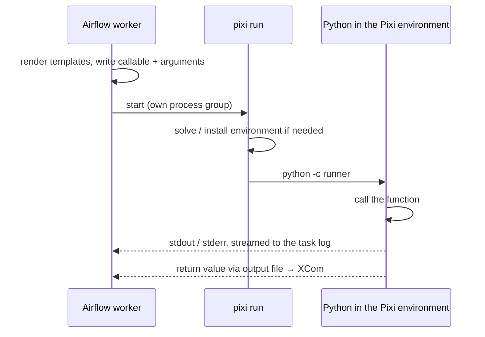

# Pixi Operator

Use the [`PixiOperator`][airflow.providers.pixi.operators.pixi.PixiOperator] to run a Python
callable inside a [Pixi](https://pixi.sh) environment. The environment can come from an existing
Pixi project, from a manifest file, or from a manifest you write inline in the DAG.

!!! tip
    For TaskFlow, use the [`@task.pixi`](../decorators/pixi.md) decorator. It accepts the same
    arguments.

## Using the operator

The callable is either a function or a `"module.path:callable_name"` string:

- A **function** is shipped as source, as `@task.virtualenv` does, so it can be defined in the DAG
  file. It must be self-contained: imports go inside it, and it cannot use variables from enclosing
  functions (pass them as arguments instead). Lambdas are not supported.
- A **string** is imported inside the environment, for code that lives in the project or is
  installed there. The manifest's directory is the working directory, so modules next to it are
  importable.

The return value becomes the task's XCom.

```python title="tests/system/pixi/example_pixi.py"
--8<-- "tests/system/pixi/example_pixi.py:pixi_operator"
```

## Choosing the environment

Specify the manifest in exactly one way. The operator raises `ValueError` when the DAG is parsed
otherwise.

=== "Project directory"

    `pixi_project_path` is a directory with a `pixi.toml` or `pyproject.toml`. The project's
    `pixi.lock` is honoured, which makes this the most reproducible option.

    ```python
    PixiOperator(
        task_id="train",
        pixi_project_path="/path/to/pixi/project",
        python_callable="mymodule:train",
        op_kwargs={"epochs": 3},
        environment="cuda",
    )
    ```

=== "Manifest file"

    `pixi_toml_path` points at a `pixi.toml` or `pyproject.toml`, and pixi uses exactly that file.

    ```python
    PixiOperator(
        task_id="evaluate",
        pixi_toml_path="/repo/pixi.toml",
        environment="test",
        python_callable="mymodule:evaluate",
    )
    ```

=== "Inline manifest"

    `dependencies` (conda) and/or `pypi_dependencies` describe the environment directly in the DAG.

    ```python
    PixiOperator(
        task_id="report",
        dependencies={"python": ">=3.10", "numpy": "*"},
        pypi_dependencies={"pandas": ">=2.0"},
        channels=["conda-forge"],
        platforms=["linux-64", "osx-arm64"],
        env_cache_path="/var/cache/pixi-airflow",
        python_callable="mymodule:report",
    )
    ```

Both paths are templated, so they can come from params or Variables, for example
`pixi_project_path="{{ params.project }}"`.

### Inline manifest options

The inline options have the same structure as the
[Pixi manifest](https://pixi.sh/latest/reference/pixi_manifest/):

| Parameter | Manifest section | Default |
|---|---|---|
| `channels` | `[workspace] channels` | `["conda-forge"]` |
| `platforms` | `[workspace] platforms` | `linux-64`, `osx-64`, `osx-arm64`, `win-64` |
| `name` | `[workspace] name` | |
| `dependencies` | `[dependencies]`, as a dict or a list of MatchSpecs | |
| `pypi_dependencies` | `[pypi-dependencies]` | |
| `pypi_options` | `[pypi-options]` | |
| `feature` | `[feature.<name>]`: a dict of features with `channels`, `platforms`, `dependencies` and `pypi_dependencies` | |
| `environments` | `[environments]` | |

!!! tip
    Pixi solves an environment for every listed platform. Restricting `platforms` to the ones your
    workers run on makes the first run of a new manifest faster.

### Reusing inline environments

By default an inline environment is built in a temporary directory for each run and removed
afterwards. Pass `cleanup_temp_manifest=False` to keep it for inspection.

With `env_cache_path`, the environment lives in `<env_cache_path>/pixi-<hash of the manifest>` and
later runs of the same manifest reuse it, like `venv_cache_path` of `PythonVirtualenvOperator`.
Concurrent runs of one manifest are safe. Old directories are not removed automatically; clean them
up yourself.

### Multiple environments

If the manifest defines several environments, for example `default`, `test` and `cuda` under
`[environments]`, set `environment` to the one to use. Omit it for Pixi's default environment.

## Arguments and return values

`op_args` and `op_kwargs` are templated, so upstream XComs and Jinja work:

```python
PixiOperator(
    task_id="report",
    pixi_project_path="/path/to/project",
    python_callable="report:write",
    op_args=[evaluate.output, "{{ ds }}"],
)
```

Arguments and the return value cross into and out of the environment with the `serializer`:

`json` (default)
:   Plain JSON values. Values JSON cannot hold fail the task instead of being converted.

`pickle`
:   Any picklable value. Its types must be importable both on the worker and inside the Pixi
    environment. Pickle protocol 4 is used, so environments with older Pythons can read it.

A callable that exits without returning, for example through `sys.exit()`, fails the task.

## How it works

At run time the operator runs

```text
pixi run --manifest-path <manifest> [--environment <env>] python -c <runner> <serializer> <input> <output>
```

with the manifest's directory as working directory. The runner reads the callable and its
arguments from the input file, calls it, and writes the return value to the output file, so stdout
and stderr stay free for the task log.



## Logs, timeouts and killing

Everything the run prints, pixi's own messages included, is streamed to the task log as it
happens. When pixi exits with a non-zero code, the task fails with the last lines of output in the
error message.

There is no built-in time limit: set Airflow's `execution_timeout`. When it expires, or the task is
killed, the operator stops pixi and every process it started (`SIGTERM`, then `SIGKILL` after
10 seconds).

## Auto-install Pixi

If the Pixi binary (`pixi_binary`, default `pixi`) is not on `PATH`, the operator runs the
[official install script](https://pixi.sh/latest/installation/) and uses the installed binary:

| Platform | Install command | Binary |
|---|---|---|
| Linux, macOS | `curl -fsSL https://pixi.sh/install.sh \| sh` | `~/.pixi/bin/pixi` |
| Windows | `irm -useb https://pixi.sh/install.ps1 \| iex` | `%LOCALAPPDATA%\pixi\bin\pixi.exe` |

Pass `auto_install_pixi=False` to fail instead, for example on workers without internet access.

## Cache directories

Point Pixi, uv and pip at shared cache directories through
[Airflow Variables](https://airflow.apache.org/docs/apache-airflow/stable/core-concepts/variables.html).
Set the Variable names on the operator, or for all tasks via `default_args`, then create the
Variables in the Airflow UI or with `airflow variables set <name> <path>`:

| Operator parameter | Environment variable set for the run | Typical Variable name |
|---|---|---|
| `pixi_cache_dir_variable` | `PIXI_CACHE_DIR` | `pixi_cache_dir` |
| `uv_cache_dir_variable` | `UV_CACHE_DIR` | `uv_cache_dir` |
| `pip_cache_dir_variable` | `PIP_CACHE_DIR` | `pip_cache_dir` |

```python
with DAG(
    "my_pipeline",
    default_args={"pixi_cache_dir_variable": "pixi_cache_dir"},
) as dag: ...
```

The Variables are read when the task runs. A missing Variable leaves the environment variable
unset, so the tool's default applies.

## Templated fields

`op_args`, `op_kwargs`, `pixi_project_path`, `pixi_toml_path`, `pixi_cache_dir_variable`,
`uv_cache_dir_variable` and `pip_cache_dir_variable`.

## Reference

For the full list of parameters, see the
[`PixiOperator` API reference][airflow.providers.pixi.operators.pixi.PixiOperator].
